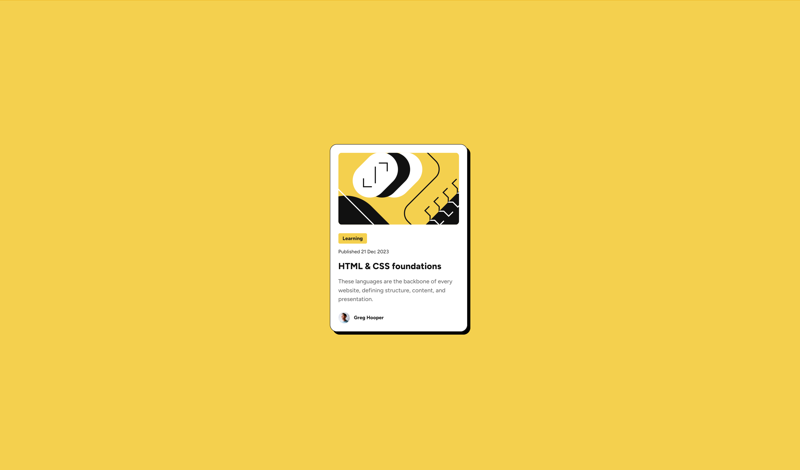

# Frontend Mentor - Blog preview card solution

This is a solution to the [Blog preview card challenge on Frontend Mentor](https://www.frontendmentor.io/challenges/blog-preview-card-ckPaj01IcS). Frontend Mentor challenges help you improve your coding skills by building realistic projects. 

## Table of contents

- [Overview](#overview)
  - [The challenge](#the-challenge)
  - [Screenshot](#screenshot)
  - [Links](#links)
- [My process](#my-process)
  - [Built with](#built-with)
  - [What I learned](#what-i-learned)
  - [Continued development](#continued-development)
  - [Useful resources](#useful-resources)
- [Author](#author)

## Overview

### The challenge

Users should be able to:

- See hover and focus states for all interactive elements on the page

### Screenshot



### Links

- Solution URL: (https://github.com/antoniomontoia/blogcard-preview)
- Live Site URL: (https://antoniomontoia.github.io/blogcard-preview/)

## My process

### Built with

- Semantic HTML5 markup
- CSS custom properties
- Flexbox

### What I learned
- Understood more about creating responsive layouts harnessing the power of CSS Flexbox.
-- Implementing responsive typography without media queries using calc() and viewport units vw and vh.
-- Ensuring image responsiveness using fit-content.

```css

.category {
    padding: 4px 12px 4px 12px;
    background-color: #F4D04E;
    border-radius: 4px;
    font-weight: 800;
    font-size: calc(12px + 0.14vw);
    line-height: 150%;
    color: #111111;
    max-width: fit-content;
    margin-bottom: 12px;
}

```


- Implementing semantic HTML elements to improve accessibility.
-- Using alt attributes for images to provide context for screen readers.

```html
<footer class="author">
      
      <p class="paragraph2">Greg Hooper</p>
</footer>
```

- Learning to use browser developer tools to inspect elements, test styles, and debug layout issues.
--Testing the design across different devices and screen sizes to ensure a consistent user experience.

### Continued development

1. Exploring CSS Grid
Study the fundamentals of CSS Grid, including grid containers, grid items, and grid areas.
Create a project that utilizes CSS Grid to build a responsive webpage, ensuring that the layout adapts seamlessly to various screen sizes.

2. Deepening Understanding of CSS Custom Properties
Enhance my understanding of CSS custom properties (variables) and their application in responsive design. Explore how CSS variables can be combined with media queries and other responsive techniques to create maintainable styles.

3. Focusing on Accessibility
Improve the accessibility of my projects by following best practices for semantic HTML and ARIA roles. I'd like to start delving a little bit deeper into the principles of accessible web design, including the importance of semantic HTML elements (e.g., <header>, <nav>, <main>, <footer>), and go further beyond that (ARIA roles, accessibility audits).

### Useful resources

- [W3Schools](www.w3schools.com) - Readily avaiable content for every language one can imagine.
- [CSS-Tricks](https://css-tricks.com/) - Go-to page with tons of concise materials on CSS.

## Author

- Frontend Mentor - [@antoniomontoia](https://www.frontendmentor.io/profile/antoniomontoia)
- Dribbble - [@franissimo](https://www.dribbble.com/franissimo)
